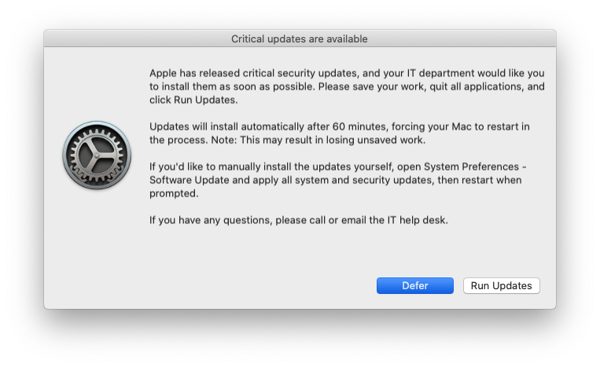
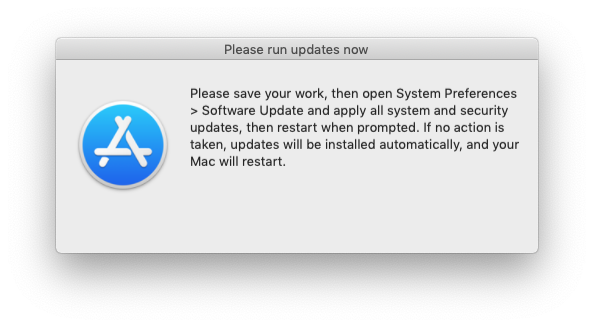
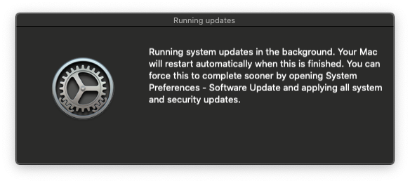

# Install or Defer

This framework will enforce the installation of pending Apple security updates on Jamf Pro-managed Macs. Users will have the option to __Install__ or __Defer__. After a specified amount of time passes, the Mac will be prompted to install the updates, then restart automatically if any updates require it.

This workflow is most useful for updates that require a restart and include important security-related patches (e.g. macOS Ventura 13.1), but also applies to application updates that don't require a restart (e.g. Safari 16.2). Basically, anything Software Update marks as "recommended" or requiring a restart is in scope.

This framework is distributed in the form of a [munkipkg](https://github.com/munki/munki-pkg) project, which allows easy creation of a new installer package when changes are made to the script or to the LaunchDaemon that runs it. See the [Installer creation](#installer-creation) section below for specific steps on creating the installer for this framework.


## Requirements

Here's what needs to be in place in order to use this framework:

- The current version of this framework officially supports __macOS Catalina, Big Sur, Monterey, and Ventura__, but older script versions should continue to function normally for previous macOS releases (note, however, that those versions of macOS are no longer receiving regular security updates from Apple and thus may not benefit from this framework).
- Target Macs must be __enrolled in Jamf Pro__ and have the `jamfHelper` binary installed.

### Optional

You might also consider implementing a __Mac with Content Caching service active__ at all major office locations. This will conserve network bandwidth and improve the download speed of updates.

## Assumptions

The following is assumed to be the case when implementing this framework:

- __An automatic restart is desired when updates require it__. This script is not necessary if restart-required updates are not mandatory within your environment and are instead left up to the person managing the Mac.
- __The Jamf Pro server has one or more policies that regularly collect inventory updates from the Mac fleet__. This will ensure that Install or Defer is only pushed to a Mac that has a pending update and avoids false-positive script runs (even though the script will not display any alerts if no updates are needed, pushing it to a Mac with no pending updates results in unnecessary memory and network bandwidth usage and should be avoided).


## Workflow detail

Here's how everything works, once it's configured:

1. When a new desired Apple security update is released, the Jamf Pro administrator creates a smart group for Macs that need this update, and adds it to the existing policy scope.
2. Macs that meet the smart group criteria run the policy at next check-in.
3. The policy installs a package that places a LaunchDaemon and a script.
4. The LaunchDaemon executes the script, which performs the following actions:
    1. The script runs `softwareupdate --list` to determine if any updates are required (determined by whether the update is labeled as recommended and/or requiring a restart). If no such updates are found, the script and LaunchDaemon self-destruct.
    2. If a required update is found, an onscreen message appears, listing the new updates that are required to be installed. Two options are given: __Install__ or __Defer__.

        (Note: your company logo will appear in place of the Software Update icon, if you specify the `LOGO` path.)

        
    3. If the user clicks __Defer__, the prompt will be dismissed. The next prompt will reappear after 4 hours by default (this is customizable). Users can continue to defer the prompt each time it appears for up to 72 hours (also customizable).
    4. When the user clicks __Install__, the script runs software updates.
5. If the deferral deadline passes, the script behaves differently:
    1. The user sees a non-dismissible prompt asking them to run updates immediately.
        
    2. If the user ignores the update prompt for 10 minutes, the script applies software updates in the background.
6. After the updates are done installing, if a restart is required:
    1. A "soft" restart is attempted.
    2. 5 minutes after the "soft" restart attempt, if the user still has not restarted (or if unsaved work prevents the "soft" restart from occurring), the script forces a restart to occur.


## Limitations

The framework has a few limitations of note:

- Sequential updates cannot be installed as a group (e.g. Security Update 2022-003 Catalina cannot be installed unless 10.15.7 is already installed). If multiple sequential security updates are available, they are treated as two separate rounds of prompting/deferring. As a result, Macs requiring sequential updates may take more than one deferral and enforcement cycle (default 3 days) to be fully patched.
- Reasonable attempts have been made to make this workflow enforceable, but there's nothing stopping an administrator of a Mac from unloading the LaunchDaemon or resetting the preference file.
- On Apple Silicon Macs, running `softwareupdate --download` and `softwareupdate --install` via background script are unsupported. When this framework is run on an Apple Silicon Mac, enforcement instead takes a "softer" form, opening Software Update and leaving a persistent prompt in place until the updates are applied. Note that this workflow requires the Software Update preference pane to be available to a user with a [secure token and volume ownership](https://support.apple.com/guide/deployment/use-secure-and-bootstrap-tokens-dep24dbdcf9e/), so that they can apply available software updates and restart their Mac.
- macOS will occasionally present major macOS upgrades (such as macOS Sonoma) on Macs running previous releases, even if an MDM profile deferring major updates is in place. The suggested workaround is to also defer minor updates (possibly for a shorter period) until you can approve the major upgrade in your environment. This script will remove Sonoma as a listed update when on macOS Ventura or older, but if the Mac sees multiple updates requiring restart, the deferred update may still be installed.
- macOS Big Sur, macOS Monterey, and macOS Ventura (prior to version 13.3) had known reliability issues when attempting to update your Mac using the `softwareupdate` binary, resulting in inconsistently presenting new updates as available or failing to install updates. Some measures have been taken to improve the reliability of this script when encountering these issues, but the recommendation for a fix is to upgrade to the current supported macOS release, as Apple is no longer providing bug fixes for these macOS versions beyond security patches.


## Settings customization

This framework is designed to work "out of the box" without any modification, but if you wish to customize the workflow to your organization's needs (e.g. changing wording in the alerts, adding corporate branding, adjusting alert timing and the maximum deferral time before update enforcement), you can make whatever changes are needed, either by deploying a configuration profile, or by directly modifying the script (__payload/Library/Scripts/Install or Defer.sh__) with a text editor (e.g. Atom) and building an installer package for deployment of your customized script.

### Configuration profile

You can customize many settings using a configuration profile targeting the `$BUNDLE_ID` preference domain. This allows you to apply different configurations to different groups of Macs (e.g. a dedicated test group could have shorter deferral times), and lets you make changes to these settings on the fly without repackaging and redeploying the script. The following settings can be defined via configuration profile keys:


#### Keys

##### Alerting

| Key                      | Type             | Default Value |Minimum Version | Description |
|--------------------------|------------------|---------------|----------------|-------------|
|`InstallButtonLabel`      |string|Install|[5.0](https://github.com/mpanighetti/install-or-defer/releases/tag/v5.0)|The label of the install button. Keep this string short since `jamfHelper` will cut off longer button labels.|
|`DeferButtonLabel`        |string|Defer|[5.0](https://github.com/mpanighetti/install-or-defer/releases/tag/v5.0)|The label of the defer button. Keep this string short since `jamfHelper` will cut off longer button labels.|
|`DisablePostInstallAlert` |boolean|`false`|[5.0.4](https://github.com/mpanighetti/install-or-defer/releases/tag/v5.0.4)|Whether to suppress the persistent alert to run updates. If set to True, clicking the install button will only launch Software Update without displaying a persistent alert to upgrade, until the deadline date is reached.|
|`MessagingLogo`           |string|Software Update icon|[5.0](https://github.com/mpanighetti/install-or-defer/releases/tag/v5.0)|File path to a logo that will be used in messaging. Recommend 512px, PNG format.|
|`SupportContact`          |string|IT|[5.0](https://github.com/mpanighetti/install-or-defer/releases/tag/v5.0)|Contact information for technical support included in messaging alerts. Recommend using a team name (e.g. "Technical Support"), email address (e.g. "support@contoso.com"), or chat channel (e.g. "#technical-support").|

##### Timing

| Key                      | Type             | Default Value |Minimum Version | Description |
|--------------------------|------------------|---------------|----------------|-------------|
|`DeferralPeriod`          |integer|`14400`|[5.0.5](https://github.com/mpanighetti/install-or-defer/releases/tag/v5.0.5)|Number of seconds between when the user clicks "Defer" and the next prompt appears. This value must be less than the `MaxDeferralTime` value.|
|`HardRestartDelay`        |integer|`300`|[5.0.5](https://github.com/mpanighetti/install-or-defer/releases/tag/v5.0.5)|Number of seconds to wait between attempting a soft restart and forcing a restart.|
|`MaxDeferralTime`         |integer|`259200`|[2.2](https://github.com/mpanighetti/install-or-defer/releases/tag/v2.2)|Number of seconds between the first script run and the updates being enforced. Defaults to 259200 (3 days).|
|`PromptTimeout`           |integer|`3600`|[5.0.5](https://github.com/mpanighetti/install-or-defer/releases/tag/v5.0.5)|Number of seconds to wait before timing out the Install or Defer prompt. This value must be less than the `DeferralPeriod` value.|
|`SkipDeferral`            |boolean|`false`|[2.2](https://github.com/mpanighetti/install-or-defer/releases/tag/v2.2)|Whether to bypass deferral time entirely and skip straight to update enforcement (useful for script testing purposes). If set to true, this setting supersedes any values set for `MaxDeferralTime`.|
|`UpdateDelay`             |integer|`600`|[5.0.5](https://github.com/mpanighetti/install-or-defer/releases/tag/v5.0.5)|Number of seconds to wait between displaying the "install updates" message and applying updates, then attempting a soft restart.|
|`WorkdayStartHour`        |integer||[5.0](https://github.com/mpanighetti/install-or-defer/releases/tag/v5.0)|The hour that a workday starts in your organization. This value must be an integer between 0 and 22, and the end hour must be later than the start hour. If the update deadline falls within this window of time, it will be moved forward to occur at the end of the workday. If `WorkdayStartHour` or `WorkdayEndHour` are undefined, deadlines will be scheduled based on maximum deferral time and not account for the time of day that the deadline lands.|
|`WorkdayEndHour`          |integer||[5.0](https://github.com/mpanighetti/install-or-defer/releases/tag/v5.0)|The hour that a workday ends in your organization. This value must be an integer between 1 and 23, and the end hour must be later than the start hour. If the update deadline falls within this window of time, it will be moved forward to occur at the end of the workday. If `WorkdayStartHour` or `WorkdayEndHour` are undefined, deadlines will be scheduled based on maximum deferral time and not account for the time of day that the deadline lands.|

##### Backend

| Key                      | Type             | Default Value |Minimum Version | Description |
|--------------------------|------------------|---------------|----------------|-------------|
|`DiagnosticLog`           |boolean|`false`|[5.0](https://github.com/mpanighetti/install-or-defer/releases/tag/v5.0)|Whether to write to a persistent log file at `/var/log/install-or-defer.log`. If undefined or set to false, the script writes all output to the system log for live diagnostics.|
|`ManualUpdates`           |boolean|Apple Silicon: `true`<br />Intel: `false`|[5.0.3](https://github.com/mpanighetti/install-or-defer/releases/tag/v5.0.3)|Whether to prompt users to run updates manually via Software Update. This is always the behavior on Apple Silicon Macs and cannot be overridden. If undefined or set to false on Intel Macs, the script triggers updates via scripted `softwareupdate` commands.|

#### Create a configuration profile in Jamf Pro

1. [Open the Install or Defer profile manifest in ProfileManifestsMirror.](https://github.com/Jamf-Custom-Profile-Schemas/ProfileManifestsMirror/blob/main/manifests/ManagedPreferencesApplications/com.github.mpanighetti.install-or-defer.json)
2. [Copy the raw contents of the file to your clipboard.](https://github.blog/changelog/2021-09-20-quickly-copy-the-contents-of-a-file-to-the-clipboard/)
3. [Create the configuration profile](https://docs.jamf.com/technical-papers/jamf-pro/json-schema/10.26.0/Customize_the_App_Using_Jamf_Pro.html):
    1. In the Jamf Pro web app, [create a new configuration profile](https://docs.jamf.com/jamf-pro/documentation/Computer_Configuration_Profiles.html).
    2. Under the **General** payload, give the configuration profile a unique name, assign a category, and set **Level** to **Computer Level**.
    3. Under **Scope**, specify the groups that will receive this profile for enforced settings. You can assign it to all computers, limit it to individual test computers, or specify one or more computer groups.
    4. Select the **Application & Custom Settings** payload, then click **External Applications**.
    5. Click **➕ Add** and select **Custom Schema** from the **Source** menu.
    6. Enter the bundle identifier (`com.github.mpanighetti.install-or-defer`) under **Preference Domain**.
    7. Under **Custom Schema**, click **➕ Add schema**.
    8. Paste the raw contents from the Install or Defer profile manifest into the text editor window, then click **Save**.
    9. Make all desired selections, using the descriptions on the page or the above table for reference. None of these are required settings; leaving one undefined will revert to script default settings for that feature.
    10. Once the profile is finished, click **Save**.

### Script variables

There are several settings in the script that can be customized by changing default variable values:

#### File paths and identifiers

- `PLIST`

    Path to a plist file that is used to store settings locally. Omit ".plist" extension.

- `BUNDLE_ID`

    The identifier of the LaunchDaemon that is used to call the `Install or Defer.sh` script, which should match the file name in the __payload/Library/LaunchDaemons__ folder. Omit ".plist" extension.

- `SCRIPT_PATH`

    The file path of the `Install or Defer.sh` script. Used in the script to assist with resource file clean-up.

#### Messaging

- `MSG_INSTALL_OR_DEFER_HEADING`

    The heading/title of the message users will receive when updates are available.

- `MSG_INSTALL_OR_DEFER`

    The body of the message users will receive when updates are available.

- `MSG_INSTALL_HEADING`

    The heading/title of the message users will receive when they must run updates immediately.

- `MSG_INSTALL`

    The body of the message users will receive when they must run updates immediately.

- `MSG_INSTALL_NOW_HEADING`

    The heading/title of the message users will receive when a manual update action is required.

- `MSG_INSTALL_NOW`

    The body of the message users will receive when a manual update action is required.

- `MSG_UPDATING_HEADING`

    The heading/title of the message users will receive when updates are running in the background.

- `MSG_UPDATING`

    The body of the message users will receive when updates are running in the background.

The above messages use the following dynamic substitutions:

- `%DEADLINE_DATE%` will be automatically replaced with the deadline date and time before updates are enforced.
- `%DEFER_HOURS%` will be automatically replaced by the number of days, hours, or minutes remaining in the deferral period.
- `%SUPPORT_CONTACT%` will be automatically replaced with "IT" or a custom value set via configuration profile key.
- `%UPDATE_LIST%` will be automatically replaced with a comma-separated list of all recommended updates found in a Software Update check.
- The section in the `{{double curly brackets}}` will be removed when this message is displayed for the final time before the deferral deadline.
- The sections in the `<<double comparison operators>>` will be removed if a restart is not required for the pending updates.

### Installer creation

1. Install the packaging prerequisites:

    - Python (does not ship with latest macOS; easiest way to get it is by installing Xcode Command Line Tools: `xcode-select --install`)
    - [munkipkg](https://github.com/munki/munki-pkg)

2. Make all desired modifications to the framework. If you make changes to the script, we recommend changing the following three things:

    - The __Last Modified__ metadata in the script.
    - The __Version__ metadata in the script.
    - The `version` key in the build-info.plist file (to match the script version).

3. With `munkipkg` installed and with `python` in your `$PATH` definitions, this command will generate a new installer package in the build folder (replace paths with the full path to munkipkg and install-or-defer respectively):

    python /path/to/munkipkg /path/to/install-or-defer

4. The subsequent installer package can be uploaded to Jamf Pro and scoped as specified below in the Jamf Pro setup section.

[See the munkipkg README for more information on how to use the tool.](https://github.com/munki/munki-pkg#basic-operation)

## Jamf Pro setup

The following objects should be created on the Jamf Pro server in order to implement this framework:


### Packages

Upload this package (created with munkipkg above) to the Jamf Pro server via Jamf Admin or via the Jamf Pro web app:

- __install-or-defer-x.x.x.pkg__


### Smart Groups

Create a smart group for each software update or operating system patch you wish to enforce. Here are some examples to serve as guides, using regular expressions to allow for fewer criteria:

#### macOS update regex

- __Critical Update Needed: macOS Ventura 13.1__
    - `Operating System Build` `matches regex` `^22[A-B]`

#### Application update regex

- __Critical Update Needed: Safari 16.2__
    - `Application Title` `is` `Safari.app`
    - `and` `(` `Application Version` `matches regex` `^(\d|1[0-5])\.`
    - `or` `Application Version` `matches regex` `^16\.[0-1]$` `)`


### Policy

Create a policy with the following criteria:

- Name: __Install or Defer__
    - Triggers:
        - __Recurring check-in__
        - Custom: __install-or-defer__
    - Execution Frequency: __Once every week__<sup>[1](#footnote1)</sup>
    - Packages:
        - __install-or-defer-x.x.x.pkg__
    - Scope:
        - One or more test Macs with one or more pending security updates.


## Testing

1. On a test Mac in scope for the __Install or Defer__ policy, open Console.app and filter for the Process `logger`, or run this Terminal command:
    ```
    log stream --style syslog --predicate 'senderImagePath ENDSWITH "logger"'
    ```

2. Open Terminal and trigger the "stash" policy that deploys the logo graphics, if not already installed:
    ```
    sudo jamf policy -event stash
    ```

3. Then trigger the __Install or Defer__ policy:
    ```
    sudo jamf policy -event install-or-defer
    ```

4. Enter your administrative password when prompted.
5. The policy should run and install the script/LaunchDaemon. Switch back to Console to view the output. You should see something like the following:
    ```
    default	16:21:07.693371 -0700	logger	Starting Install or Defer.sh script. Performing validation and error checking...
    default	16:21:09.153793 -0700	logger	Validation and error checking passed. Starting main process...
    default	16:21:09.153839 -0700	logger	No logo provided, or no logo exists at specified path. Using Software Update icon.
    default	16:21:09.884776 -0700	logger	Maximum deferral time: 72h:00m:00s
    default	16:21:10.024080 -0700	logger	Deferral deadline: 2020-04-05 16:21:09
    default	16:21:10.026087 -0700	logger	Time remaining: 71h:59m:59s
    default	16:21:10.044935 -0700	logger	Checking for pending system updates...
    default	16:21:39.218631 -0700	logger	Software Update Tool
    default	16:21:39.218681 -0700	logger
    default	16:21:39.218704 -0700	logger	Finding available software
    default	16:21:39.218724 -0700	logger
    default	16:21:39.326278 -0700	logger	Downloaded Safari
    default	16:24:26.066989 -0700	logger	Downloading Security Update 2020-002
    default	16:24:26.067232 -0700	logger	Downloaded Security Update 2020-002
    default	16:24:26.067356 -0700	logger	Done.
    default	16:24:26.122639 -0700	logger	Prompting to install updates now or defer...
    ```

6. After the updates are downloaded, you should see the following prompt appear onscreen:
    
7. Click __Defer__. You should see something like the following output appear in Console:
    ```
    default	16:24:34.444397 -0700	logger	User clicked Defer after 00h:00m:08s.
    ```

8. Run the following command in Terminal:
    ```
    sudo defaults read /Library/Preferences/com.github.mpanighetti.install-or-defer
    ```

    You should see something similar to the following output (the numbers, which represent dates, will vary):
        ```
        UpdatesDeferredUntil = 1585884274;
        UpdatesForcedAfter = 1586042469;
        ```

9. Enter the following commands to "skip ahead" to the next deferral and re-trigger the prompt:
    ```
    sudo defaults write /Library/Preferences/com.github.mpanighetti.install-or-defer UpdatesDeferredUntil -int $(date +%s)
    sudo launchctl unload /Library/LaunchDaemons/com.github.mpanighetti.install-or-defer.plist
    sudo launchctl load /Library/LaunchDaemons/com.github.mpanighetti.install-or-defer.plist
    ```

10. You should see the install/defer prompt appear again.
11. Click __Install__. As long as there are no apps with unsaved changes, the Mac will run updates in the background. You should see the following prompt appear onscreen:
    
    - If you want to test the "hard" restart feature of this framework, open Terminal and type `top` before the updates finish running. Then wait 5 minutes after "soft" restart attempt, and confirm that the Mac restarts successfully.
12. After updates are installed and (optionally) the Mac is successfully restarted, you should not see any more onscreen messages.
13. (OPTIONAL) If an additional round of updates is needed, run `sudo jamf policy -event install-or-defer` again to start the process over. Sequential updates cannot be installed as a group (see __Limitations__ section above).


## Deployment

Once the Testing steps above have been followed, there are only a few steps remaining to deploy the framework:

1. In the Jamf Pro web app, edit the __Install or Defer__ policy and click on the __Scope__ tab.
2. Remove the test Macs from the scope.
3. Add all the __Critical Update Needed__ smart groups into the scope.
4. Click __Save__.
5. Monitor the policy logs to ensure the script is working as expected.


## Rollback

If major problems are detected with the update prompt or installation workflow, disable the __Install or Defer__ policy. This will prevent computers from being newly prompted for installation of updates.

Note that any computers which have already received the framework push will continue through the motions of alerting, deferring, updating, and restarting. If you need to remove the framework from your fleet and stop it from running, you could write an uninstall script using the `preinstall` script as a foundation (it would basically just need to unload the LaunchDaemons and remove the resource files).

Once the script is debugged and updated, you can generate a new installer package, upload the package to the Jamf Pro server, link it to the policy, and re-enable the policy. The `preinstall` script will remove any existing resources and replace them with your modified files.


## Troubleshooting

### Error "Path had bad ownership/permissions" when running LaunchDaemon

This most likely means that Install or Defer was manually downloaded and modified, and the LaunchDaemon was given incorrect ownership and permissions in the process of downloading the resource files. If you're using munkipkg to build the package, this should be fixed as of [version 3.0.1](https://github.com/mpanighetti/install-or-defer/releases/tag/v3.0.1), but if you're packaging the project using other means, make sure you run these commands beforehand:

```
sudo chown root:wheel /path/to/install-or-defer/payload/Library/LaunchDaemons/com.github.mpanighetti.install-or-defer.plist
sudo chmod 644 /path/to/install-or-defer/payload/Library/LaunchDaemons/com.github.mpanighetti.install-or-defer.plist
```


## Miscellaneous Notes

- Feel free to change the `com.github.mpanighetti` bundle identifier to match your company instead. If you do this, make sure to update the filenames of the LaunchDaemons, their corresponding file paths in the `preinstall` and `postinstall` scripts, the `$BUNDLE_ID` variable in the script, and the bundle identifier used for settings enforced via configuration profile.
- If you encounter any issues or have questions, please open an issue on this GitHub repo.

Enjoy!

<a name="footnote1"><sup>1</sup></a> This example frequency assumes you're using the default deferral period of 72 hours. If you've set a custom deferral period, it is recommended that your policy runs less frequently than the maximum deferral time, so that your Macs have the chance to defer, timeout, and apply the updates before the policy attempts to run again (since the `preinstall` script will reset `UpdatesDeferredUntil` and `UpdatesForcedAfter`).
