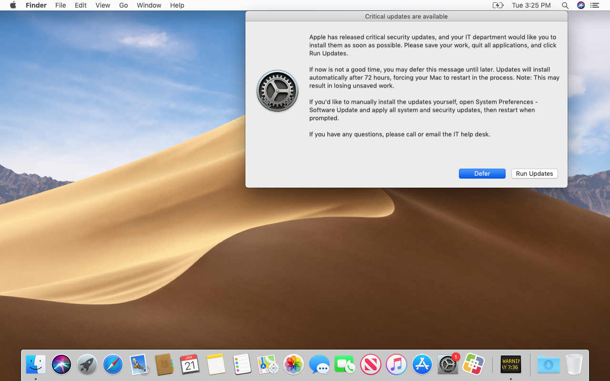

# Install or Defer

This framework will enforce the installation of pending Apple security updates on Jamf Pro-managed Macs. Users will have the option to __Run Updates__ or __Defer__. After a specified amount of time passes, the Mac will be forced to install the updates, then restart automatically if any updates require it.



This workflow is most useful for updates that require a restart and include important security-related patches (e.g. macOS Catalina 10.15.2), but also applies to critical security updates that don't require a restart (e.g. Safari 13.0.4). Basically, anything with the `Recommended: YES` and/or `Action: restart` label in the `softwareupdate` catalog is in scope.

This framework is distributed in the form of a [munkipkg](https://github.com/munki/munki-pkg) project, which allows easy creation of a new installer package when changes are made to the script or to the LaunchDaemon that runs it (despite the name, packages generated with munkipkg don't require Munki; they work great with Jamf Pro). See the [Installer creation](#installer-creation) section below for specific steps on creating the installer for this framework.


## Requirements and assumptions

Here's what needs to be in place in order to use this framework:

- The current version of this framework has been tested only on __macOS 10.13 through 10.15__, but older versions should continue to function normally for previous macOS builds (note, however, that those versions of macOS are no longer receiving regular security updates from Apple and thus may not benefit from this framework).
- Target Macs must be __enrolled in Jamf Pro__ and have the `jamfHelper` binary installed.
- We're assuming that __an automatic restart is desired when updates require it__.
- We're assuming that the Jamf Pro server has one or more policies that regularly collect inventory updates from the Mac fleet. This will ensure that Install or Defer is only pushed to a Mac that has a pending update and avoids false-positive script runs (even though the script will not display any alerts if no updates are needed, pushing it to a Mac that doesn't need it results in unnecessary memory and network bandwidth usage and should be avoided).
- Optional: a __company logo__ graphic file in a "stash" on each Mac (if no logo is provided, the Software Update icon will be used).
- Optional but recommended: a __Mac with Content Caching service active__ at all major office locations. This will conserve network bandwidth and improve the download speed of updates.


## Workflow detail

Here's how everything works, once it's configured:

1. When a new critical Apple security update is released, the Jamf Pro administrator creates a smart group for Macs that need this update, and adds it to the existing policy scope.
2. Macs that meet the smart group criteria run the policy at next check-in.
3. The policy installs a package that places a LaunchDaemon and a script.
4. The LaunchDaemon executes the script, which performs the following actions:
    1. The script runs `softwareupdate --list` to determine if any updates are required (determined by whether the update is labeled as recommended and/or requiring a restart). If no such updates are found, the script and LaunchDaemon self-destruct.
    2. If a required update is found, the script runs `softwareupdate --download --all` or `softwareupdate --download --recommended` to cache all available recommended Apple updates in the background (`--all` if a restart is required for any updates, `--recommended` if not).
    3. An onscreen message appears, indicating the new updates are required to be installed. Two options are given: __Run Updates__ or __Defer__.

        (Note: your company logo will appear in place of the Software Update icon, if you specify the `LOGO` path.)

        
    4. If the user clicks __Defer__, the prompt will be dismissed. The next prompt will reappear after 4 hours by default (this is customizable). Users can continue to defer the prompt each time it appears for up to 72 hours (also customizable).
    5. When the user clicks __Run Updates__, the script runs the cached software updates.
5. If the deferral deadline passes, the script behaves differently:
    1. The user sees a non-dismissible prompt asking them to run updates immediately.
        
    2. If the user ignores the update prompt for 10 minutes, the script applies the cached updates in the background.
6. After the updates are done installing, if a restart is required:
    1. A "soft" restart is attempted.
    2. 5 minutes after the "soft" restart attempt, if the user still has not restarted (or if unsaved work prevents the "soft" restart from occurring), the script forces a restart to occur.


## Limitations

The framework has two major limitations:

- Sequential updates cannot be installed as a group (e.g. Security Update 2019-002 Mojave cannot be installed unless 10.14.6 is already installed). If multiple sequential critical updates are available, they are treated as two separate rounds of prompting/deferring. As a result, Macs requiring sequential updates may take more than one deferral/enforcement cycle (default 3 days) to be fully patched.
- Reasonable attempts have been made to make this workflow enforceable, but there's nothing stopping an administrator of a Mac from unloading the LaunchDaemon or resetting the preference file.


## Settings customization

This framework is designed to work "out of the box" without any modification, but if you wish to customize the workflow to your organization's needs (e.g. changing wording in the alerts, adding corporate branding, adjusting alert timing and the maximum deferral time before update enforcement), you can make whatever changes are needed, either by deploying a configuration profile, or by directly modifying the script (__payload/Library/Scripts/Install or Defer.sh__) with a text editor (e.g. Atom) and building an installer package for deployment of your customized script.

### Configuration profile

You can customize some values using a configuration profile targeting the `$BUNDLE_ID` preference domain. This allows you to apply different configurations to different groups of Macs (e.g. a dedicated test group could have shorter deferral times), and lets you make changes to these settings on the fly without repackaging and redeploying the script. The following keys can be defined via configuration profile:

- `MaxDeferralTime`

    **Integer**. Number of seconds between the first script run and the updates being enforced. Defaults to `259200` (3 days).

- `SkipDeferral`

    **Boolean**. Whether to bypass deferral time entirely and skip straight to update enforcement (useful for script testing purposes). Defaults to `false`.

### Script variables

There are several settings in the script that can be customized by changing default variable values:

#### File paths and identifiers

- `PLIST`

    Path to a plist file that is used to store settings locally. Omit ".plist" extension.

- `LOGO`

    (Optional) Path to a logo that will be used in messaging. Recommend 512px, PNG format. If no logo is provided, the Software Update icon will be used (as shown in the example screenshots in this README).

- `BUNDLE_ID`

    The identifier of the LaunchDaemon that is used to call this script, which should match the file in the __payload/Library/LaunchDaemons__ folder. Omit ".plist" extension.

- `SCRIPT_PATH`

    The file path of the `Install or Defer.sh` script. Used in the script to assist with resource file clean-up.

#### Messaging

- `MSG_ACT_OR_DEFER_HEADING`

    The heading/title of the message users will receive when updates are available.

- `MSG_ACT_OR_DEFER`

    The body of the message users will receive when updates are available.

- `MSG_ACT_HEADING`

    The heading/title of the message users will receive when they must run updates immediately.

- `MSG_ACT`

    The body of the message users will receive when they must run updates immediately.

- `MSG_UPDATING_HEADING`

    The heading/title of the message users will receive when updates are running in the background.

- `MSG_UPDATING`

    The body of the message users will receive when updates are running in the background.

The above messages use the following dynamic substitutions:

- `%DEFER_HOURS%` will be automatically replaced by the number of hours remaining in the deferral period.
- `%UPDATE_MECHANISM%` will be automatically replaced by either "App Store > Updates" or "System Preferences > Software Update" depending on the version of macOS.
- The section in the `<<double comparison operators>>` will be removed if a restart is not required.
- The section in the `{{double curly brackets}}` will be removed when this message is displayed for the final time before the deferral deadline.

#### Timing

- `EACH_DEFER`

    When the user clicks "Defer" the next prompt is delayed by this much time.

- `UPDATE_DELAY`

    The number of seconds to wait between displaying the "run updates" message and applying updates, then attempting a soft restart.

- `HARD_RESTART_DELAY`

    The number of seconds to wait between attempting a soft restart and forcing a restart.


### Installer creation

Download and install [munkipkg](https://github.com/munki/munki-pkg), if you haven't already. Add the `munkipkg` binary location to your `PATH` or create an alias in your bash profile so that you can reference the command directly.

If you make changes to the script, we recommend changing the following three things:

- The Last Modified metadata in the script.
- The Version metadata in the script.
- The `version` key in the build-info.plist file (to match the script version).

With munkipkg installed, this command will generate a new installer package in the build folder:

    munkipkg /path/to/install-or-defer

The subsequent installer package can be uploaded to Jamf Pro and scoped as specified below in the Jamf Pro setup section.


## Jamf Pro setup

The following objects should be created on the Jamf Pro server in order to implement this framework:


### Packages

Upload this package (created with munkipkg above) to the Jamf Pro server via Jamf Admin or via the Jamf Pro web app:

- __install-or-defer-x.x.x.pkg__


### Smart Groups

Create a smart group for each software update or operating system patch you wish to enforce. Here are some examples to serve as guides, using regular expressions to allow for fewer criteria:

- __Critical Update Needed: macOS Catalina 10.15.2__
    - `Operating System Build` `matches regex` `^19[A-B]`
- __Critical Update Needed: Security Update 2019-007 High Sierra__
    - `Operating System Build` `matches regex` `^17G\d{1,4}$`

For completion's sake, here's an example of an update that won't require a restart but is still tagged as `Recommended: YES` in the `softwareupdate` catalog:

- __Critical Update Needed: Safari 13.0.4__
    - `Application Title` `is` `Safari.app`
    - `and` `(` `Application Version` `matches regex` `^\d\.`
    - `or` `Application Version` `matches regex` `^1[0-2]\.`
    - `or` `Application Version` `matches regex` `^13\.0\.[0-3]` `)`


### Policy

Create a policy with the following criteria:

- Name: __Install or Defer__
    - Triggers:
        - __Recurring check-in__
        - Custom: __install-or-defer__
    - Execution Frequency: __Once every week__<sup>[1](#footnote1)</sup>
    - Packages:
        - __install-or-defer-x.x.x.pkg__
    - Scope:
        - One or more test Macs with one or more pending security updates.


## Testing

1. On a test Mac in scope for the __Install or Defer__ policy, open Console.app and filter for the Process `logger`, or run this Terminal command:
    ```
    log stream --style syslog --predicate 'senderImagePath ENDSWITH "logger"'
    ```

2. Open Terminal and trigger the "stash" policy that deploys the logo graphics, if not already installed:
    ```
    sudo jamf policy -event stash
    ```

3. Then trigger the __Install or Defer__ policy:
    ```
    sudo jamf policy -event install-or-defer
    ```

4. Enter your administrative password when prompted.
5. The policy should run and install the script/LaunchDaemon. Switch back to Console to view the output. You should see something like the following:
    ```
    Starting Install or Defer.sh script. Performing validation and error checking...
    Validation and error checking passed. Starting main process...
    Deferral deadline: 2020-01-25 12:19:55
    Time remaining: 72h:00m:00s
    Checking for pending system updates...
    Caching all system updates...
    Software Update Tool

    Finding available software
    Software Update found the following new or updated software:
    * Label: macOS 10.15 Update-
        Title: macOS 10.15 Update, Version:  , Size: 962326K, Recommended: YES, Action: restart,

    Downloaded macOS 10.15 Update-
    Done.
    Prompting to install updates now or defer...
    ```

6. After the updates are downloaded, you should see the following prompt appear onscreen:
    
7. Click __Defer__. You should see something like the following output appear in Console:
    ```
    User clicked Defer after 00h:00m:20s.
    Next prompt will appear after 2020-01-25 16:20:05.
    ```

8. Run the following command in Terminal:
    ```
    sudo defaults read /Library/Preferences/com.github.mpanighetti.install-or-defer
    ```

    You should see something similar to the following output (the numbers, which represent dates, will vary):
        ```
            AppleSoftwareUpdatesDeferredUntil = 1579971863;
            AppleSoftwareUpdatesForcedAfter = 1579986263;
        ```

9. Enter the following commands to "skip ahead" to the next deferral and re-trigger the prompt:
    ```
    sudo defaults write /Library/Preferences/com.github.mpanighetti.install-or-defer AppleSoftwareUpdatesDeferredUntil -int $(date +%s)
    sudo launchctl unload /Library/LaunchDaemons/com.github.mpanighetti.install-or-defer.plist
    sudo launchctl load /Library/LaunchDaemons/com.github.mpanighetti.install-or-defer.plist
    ```

10. You should see the install/defer prompt appear again.
11. Click __Run Updates__. As long as there are no apps with unsaved changes, the Mac will run updates in the background. You should see the following prompt appear onscreen:
    
    - If you want to test the "hard" restart feature of this framework, open Terminal and type `top` before the updates finish running. Then wait 5 minutes after "soft" restart attempt, and confirm that the Mac restarts successfully.
12. After updates are installed and (optionally) the Mac is successfully restarted, you should not see any more onscreen messages.
13. (OPTIONAL) If an additional round of updates is needed, run `sudo jamf policy -event install-or-defer` again to start the process over. Sequential updates cannot be installed as a group (see __Limitations__ section above).


## Deployment

Once the Testing steps above have been followed, there are only a few steps remaining to deploy the framework:

1. On the Jamf Pro web app, edit the __Install or Defer__ policy and click on the __Scope__ tab.
2. Remove the test Macs from the scope.
3. Add all the __Critical Update Needed__ smart groups into the scope.
4. Click __Save__.
5. Monitor the policy logs to ensure the script is working as expected.


## Rollback

If major problems are detected with the critical update prompt or installation workflow, disable the __Install or Defer__ policy. This will prevent computers from being newly prompted for installation of updates.

Note that any computers which have already received the framework push will continue through the motions of alerting, deferring, updating, and restarting. If you need to remove the framework from your fleet and stop it from running, you could write an uninstall script using the preinstall script as a foundation (it would basically just need to unload the LaunchDaemons and remove the resource files).

Once the script is debugged and updated, you can generate a new installer package, upload the package to the Jamf Pro server, link it to the policy, and re-enable the policy. The preinstall script will remove any existing resources and replace them with your modified files.


## Troubleshooting

### Error "Path had bad ownership/permissions" when running LaunchDaemon

This most likely means that Install or Defer was manually downloaded and modified, and the LaunchDaemon was given incorrect ownership and permissions in the process of downloading the resource files. If you're using munkipkg to build the package, this should be fixed as of [version 3.0.1](https://github.com/mpanighetti/install-or-defer/compare/v3.0...v3.0.1), but if you're packaging the project using other means, make sure you run these commands beforehand:

```
sudo chown root:wheel /path/to/install-or-defer/payload/Library/LaunchDaemons/com.github.mpanighetti.install-or-defer.plist
sudo chmod 644 /path/to/install-or-defer/payload/Library/LaunchDaemons/com.github.mpanighetti.install-or-defer.plist
```


## Miscellaneous Notes

- Feel free to change the `com.github.mpanighetti` style identifier to match your company instead. If you do this, make sure to update the filenames of the LaunchDaemons, their corresponding file paths in the preinstall and postinstall scripts, and the `$BUNDLE_ID` variable in the script.
- You can specify a different default logo if you'd rather not use the Software Update icon (e.g. corporate branding). `jamfHelper` supports .icns and .png files.
- If you encounter any issues or have questions, please open an issue on this GitHub repo.

Enjoy!

<a name="footnote1"><sup>1</sup></a> This example frequency assumes you're using the default deferral period of 72 hours. If you've set a custom deferral period, it is recommended that your policy runs less frequently than the maximum deferral time, so that your Macs have the chance to defer, timeout, and apply the updates before the policy attempts to run again (since the preinstall script will reset `AppleSoftwareUpdatesDeferredUntil` and `AppleSoftwareUpdatesForcedAfter`).
